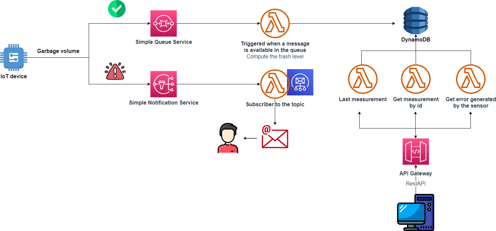

# Intelligent-garbage-collection-with-IoT
The goal of this project is to use IoT devices to perform efficient public waste collection. The idea is to equip each bins with a smart device, to monitor the volume of waste. Once all the data are obtained, offer the ability to view the status of the bins and plan collection efficiently, for example, by prioritizing bins that are full.
# Implementation details
## Architecture of the proposed solution
To implement the solution, some AWS services were used and these were simulated with [localstack](https://docs.localstack.cloud/getting-started/quickstart/).



Brief description of the services used:
- **SQS (Simple Queue Service)**: this service is used to put in a queue the data captured by the IoT sensor. When new data are available in the queue, a Lambda function is triggered to process the data and store it in a table in the DynamoDB.
- **SNS (Simple Notification Service)**: a service that follows the publish and subscriber messaging pattern, it is used in case an IoT sensor fails. 
- **DynamoDB**: this is a NoSQL Database, that is used to store all the data captured from the IoT devices.
- **API Gateway**: is an aws service that allows to build a RESTful API. It was used because in this way we are free to be able to modify the lambda functions or even use other mechanisms for the backend (for example, use an EC2 instance) without having to modify anything on the clients that use the service.
- **SES (Simple Email Service)**: this service is used to send an alert via email to the user when an IoT devices fails.  
- **Lambda function**: as can be seen from the image of the architecture, some lambda functions have been used, both to create the backend of the application and to process the data that the IoT sensors send to the queue and to the topic.

## How it works
The idea is to have an IoT sensor on top of the bins, under the lid, which, thanks to an infrared sensor, calculates the distance from the lid to the garbage (every 10 minutes). Then the device returns a distance in centimeters and sent it to the queue, and then the lambda function when processing this data, determines if the bin is in one of the following five states: 
- EMPTY
- LOW 
- MEDIUM
- HIGH 
- TO BE EMPTIED 

Together with other data such as: ***measurement date***, ***device location*** and ***device ID***, they are saved in the database by the lambda function.

When an IoT device fail in the measurement, a message is sent to the topic. A lambda function is setted as subscriber and when a message arrives, it uses the **SES** service to send an email to notify the user of the error that has occurred (this is only simulated due to limitations placed by the community version of localstack).

Lastly, the other 3 lambda functions are invoked through the RESTful api, built with API gateways, and these act as a back-end for the web-application created, which allows you to: *view the status of the sensors with their position on the map*, *to calculate the best route for waste collection* and *finally a panel where you can see a history of the measurement errors generated by the sensors*.

## Technologies used for the front-end
HTML and JavaScript were used for the front-end to generate the dynamic content retrieved from the REST api. The following libraries were used in the JavaScript part:
- [Leaflet](https://leafletjs.com/), for creating dynamic maps based on [OpenStreetMap](https://www.openstreetmap.org/)
- [Leaflet routing machine](http://www.liedman.net/leaflet-routing-machine/tutorials/), a library that integrates with leaflets for creating routes.
- [Valhalla](https://valhalla.github.io/valhalla/), a simple service that allows you to calculate the best route between multiple itineraries.
- [Bulma](https://bulma.io/), is a framework that simply allows you to create responsive and modern UI.

# How to use
Clone this repository:
```sh
git clone https://github.com/GabrieleT0/Intelligent-garbage-collection-with-IoT.git
```
Install the requirements:
```sh
pip install -r requirements.txt
```
Move to the directory of the project, and create the custom_files directory (is required to host in local Valhalla).
```sh
cd Intelligent-garbage-collection-with-IoT
mkdir custom_files
#This downloads some files which are needed to calculate the route, in particular, we only download data relating to southern Italy.
wget -O custom_files/italy-sud-latest.osm.pbf https://download.geofabrik.de/europe/italy/sud-latest.osm.pbf
#Install jq to enable the script to save same info in JSON file
```
Install jq to allow the script to save and parse json files:
```sh
sudo apt-get install jq
```
Build the container which includes localstack for AWS services, Valhalla for routing and ngnix for hosting the web app.
```sh
docker-compose up
```
Lastly, launch the ```setup.sh``` script to build all the AWS services needed and deploy the lambda functions (to run the script you should have the aws CLI installed, details [here](https://docs.aws.amazon.com/cli/latest/userguide/getting-started-install.html), then you need to configure it with the `aws configure comand`, and use us-east-1 as region and JSON as output format).
```sh
sh setup.sh
```

### What the setup.sh script does (only a few instructions are given, those considered most important)
1. Queue Creation
```sh
aws sqs create-queue --queue-name Bins_Salerno --endpoint-url=http://localhost:4566
```
2. Topic creation
```sh
aws sns create-topic --name sensor_error --endpoint-url=http://localhost:4566
```

3. Deploy lambda function simulating iot device
```sh
aws lambda create-function \
    --function-name iot_devices_lambda \
    --runtime python3.8 \
    --handler IoTDevices.lambda_handler\
    --memory-size 128 \
    --zip-file fileb://iotDevices.zip \
    --role arn:aws:iam::111111111111:role/apigw \
    --timeout 600 \
    --endpoint-url http://localhost:4566
```

4. Activation of the trigger timer
```sh
#Event creation, this use the CloudWatch Events service.
aws events put-rule \
    --name my-scheduled-rule \
    --schedule-expression 'rate(10 minutes)'\
    --endpoint-url http://localhost:4566 

#Set this permission to trust the CloudWatch Events and scope permissions to the rule with the specified Amazon Resource
aws lambda add-permission \
    --function-name iot_devices_lambda \
    --statement-id my-scheduled-event \
    --action 'lambda:InvokeFunction' \
    --principal events.amazonaws.com \
    --source-arn arn:aws:events:us-east-1:000000000000:rule/my-scheduled-rule\
    --endpoint-url http://localhost:4566 

#Add the lambda function that we want to trigger it evert 10 minutes
aws events put-targets --rule my-scheduled-rule --targets file://targets.json --endpoint-url http://localhost:4566

```

5. Table creation in noSQL database

```sh
python create_table.py
```

6. Running `deploy_APIG_lambda.sh`, this deploy the other lambda function needed for the back-end of the web application and attach them to the API Gateway service.

```sh
#This subscribe the lambda function to the topic created before
aws sns subscribe --protocol lambda \
  --topic-arn arn:aws:sns:us-east-1:000000000000:sensor_error \
  --notification-endpoint arn:aws:lambda:us-east-1:000000000000:function:apigw-lambda3 \
  --endpoint-url http://localhost:4566

#Creation of the API Gateway service
aws apigateway create-rest-api --name 'API Gateway Lambda integration' --endpoint-url http://localhost:4566

#Fetch the resources for the API
aws apigateway get-resources --rest-api-id $REST_API_ID --endpoint-url http://localhost:4566

#Create a new resource for the API
aws apigateway create-resource \
  --rest-api-id $REST_API_ID \
  --parent-id $PARENT_ID \
  --path-part "{somethingId}"\
  --endpoint-url http://localhost:4566 \

#Add a GET method to the resource
aws apigateway put-method \
  --rest-api-id $REST_API_ID \
  --resource-id $RESOURCE_ID \
  --http-method GET \
  --request-parameters "method.request.path.somethingId=true" \
  --authorization-type "NONE" \
  --endpoint-url http://localhost:4566 

#The following command integrates the GET method with the Lambda function 
aws apigateway put-integration \
  --rest-api-id $REST_API_ID \
  --resource-id $RESOURCE_ID \
  --http-method GET \
  --type AWS_PROXY \
  --integration-http-method POST \
  --uri arn:aws:apigateway:us-east-1:lambda:path/2015-03-31/functions/arn:aws:lambda:us-east-1:000000000000:function:apigw-lambda/invocations \
  --passthrough-behavior WHEN_NO_MATCH \
  --endpoint-url http://localhost:4566

#Create a new deployment for the API 
aws apigateway create-deployment \
  --rest-api-id $REST_API_ID \
  --stage-name test \
  --endpoint-url http://localhost:4566
```

